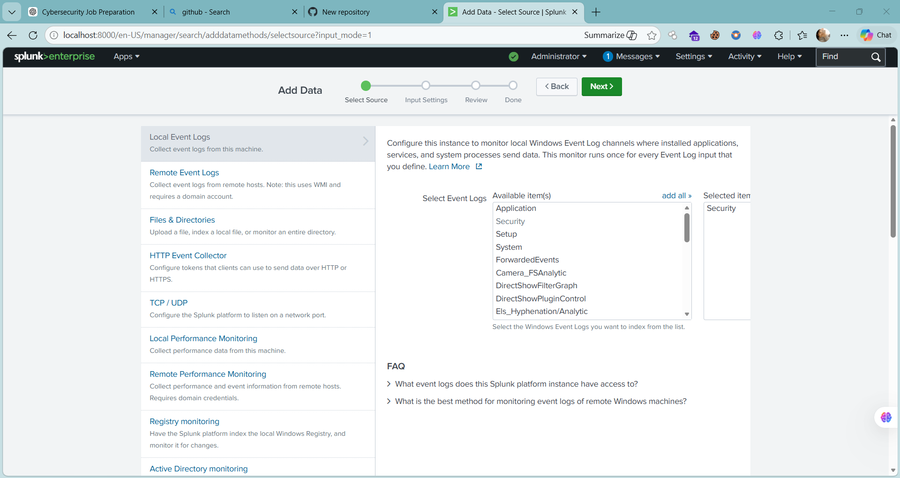
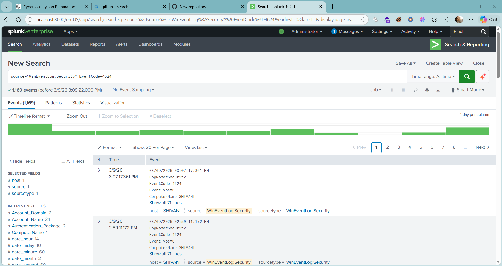
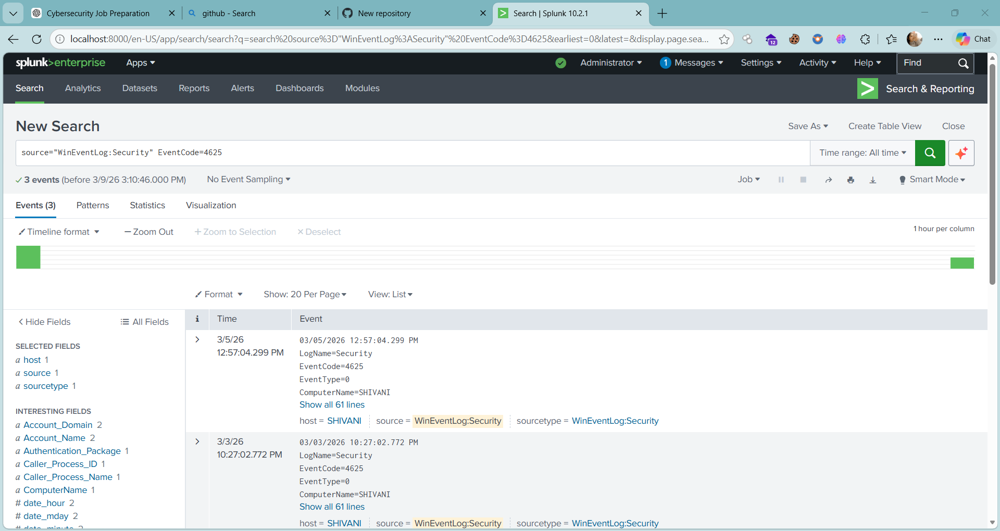
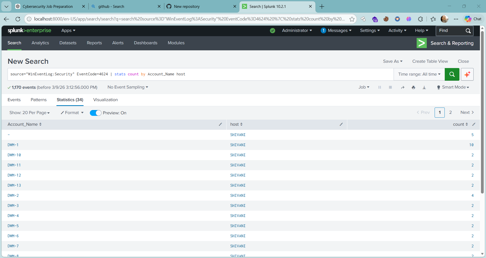
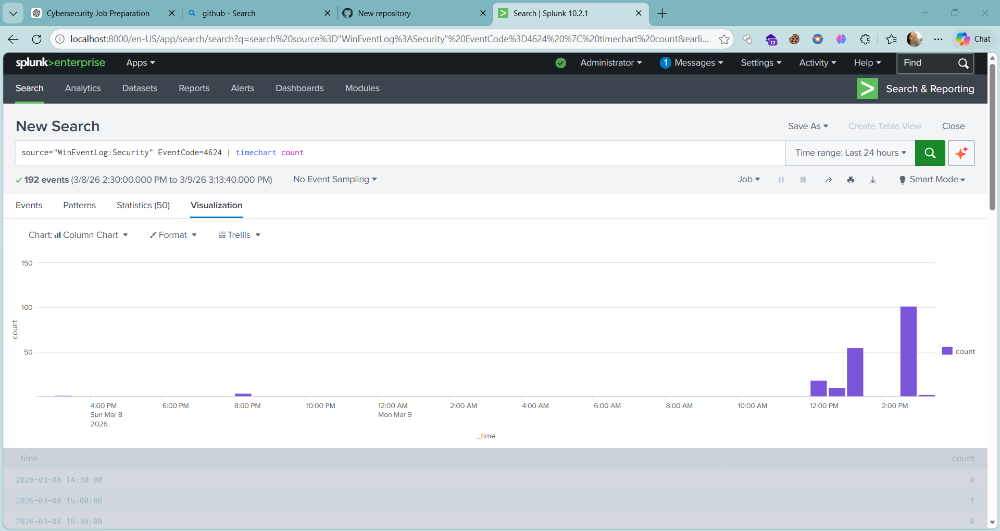

# Security Log Monitoring using Splunk

## Project Overview
This project demonstrates how Splunk SIEM can be used to monitor Windows Security Event Logs and analyze login activity.

## Data Source
Windows Security Event Logs collected from the local system and ingested into Splunk.

## Event IDs Investigated
- Event ID 4624 – Successful login
- Event ID 4625 – Failed login attempt

## SPL Queries Used
source="WinEventLog:Security" EventCode=4624

source="WinEventLog:Security" EventCode=4625

| stats count by Account_Name host

| timechart count

## Analysis Performed
- Monitored successful and failed login activity
- Identified login frequency by user accounts
- Investigated login patterns over time
- Visualized authentication activity using Splunk charts

## Tools Used
- Splunk Enterprise
- Windows Event Logs

- ## Screenshots

### Log Ingestion

### Successful Login Events (Event ID 4624)

### Failed Login Events (Event ID 4625)

### Login Activity by User

### Login Activity Over Time

